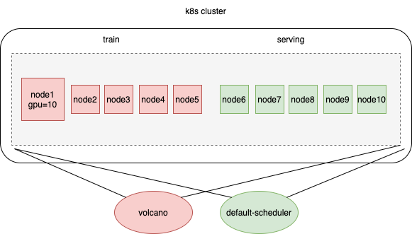

## Introduction

This feature allows volcano to schedule workloads based on the Nodes with specific label(not all nodes of k8s cluster). 

In my case, k8s cluster has 10 nodes (10 GPUs per node), 5 for training, 5 for serving, I want to use volcano schedule training job(tfjob/pytorchjob/vcjob) on training nodes. use default-scheduler schedule online pod on serving nodes. 



if you just want to schedule workloads on training nodes, you can use nodeSelector or nodeAffinity on `Pod.Spec`. but it is not properly when considering volcano queue mechanism, because volcano think it can work on 10 node (and use all resources of 10 nodes), it has 100 GPUs. but in fact, it only can work on 5 nodes for training, it has 50 GPUs. 

if there are two queue: queue1 and queue2

||weight|reclaimable|deserved GPUs|
|---|---|---|---|
|queue1|1|true|50|
|queue2|1|true|50|

if queue1 already used 45 GPUs, then i submit a training job of queue2 using 10 GPUs, the job will pending because are not enough GPUs on training nodes, and queue1 is not overused in volcano's view, so it will not reclaim job of queue1 to release resource.   

so it is necessary to tell volcano scheduler that it can only work on training nodes(not all nodes in cluster), queue1 can only use 25 GPUs normally, it is overused for queue1 to use 45 GPUs.


so I add nodeSelector (in `scheduler.conf`) for volcano scheduler.

## Usage

in following example, volcano can only work on the node which has `nodeRole:training` or `nodeRole:dev` or `gpuModel: tesla` label. you can use any label name you like.

```yaml
    actions: "enqueue, allocate,reclaim, backfill"
    tiers:
    - plugins:
      - name: priority
      - name: gang
      - name: conformance
    - plugins:
      - name: overcommit
      - name: drf
      - name: predicates
      - name: proportion
      - name: nodeorder
      - name: binpack
    ## volcano can only work on the nodes with following label
    nodeSelector:  
      nodeRole: training,dev
      gpuModel: tesla
```

## Design

parse nodeSelector from `scheduler.conf` and transfer the labels into `SchedulerCache.nodeSelector`
```go
// pkg/scheduler/cache/cache.go
type SchedulerCache struct {
	// added field
    nodeSelector    map[string]string
}

```
use `useNode` to filter the node when running `SchedulerCache.AddNode` or `SchedulerCache.UpdateNode`
```go
// pkg/scheduler/cache/event_handlers.go 
// added function
func (sc *SchedulerCache) useNode(node *v1.Node) bool {
    if len(sc.nodeSelector) == 0 {
        return true
    }
    for labelName, labelValue := range node.Labels {
        key := labelName + ":" + labelValue
        if _, ok := sc.nodeSelector[key]; ok {
            return true
        }
    }
    klog.Infof("node %s ignore add/update/delete into schedulerCache", node.Name)
    return false
}
func (sc *SchedulerCache) AddNode(obj interface{}) {
    ...
    if !sc.useNode(node) {
        return
    }
    err := sc.addNode(node)
    ...
}
func (sc *SchedulerCache) UpdateNode(obj interface{}) {
	...
    if !sc.useNode(newNode) {
        return
    }
    err := sc.updateNode(oldNode, newNode)
    ...
}
```